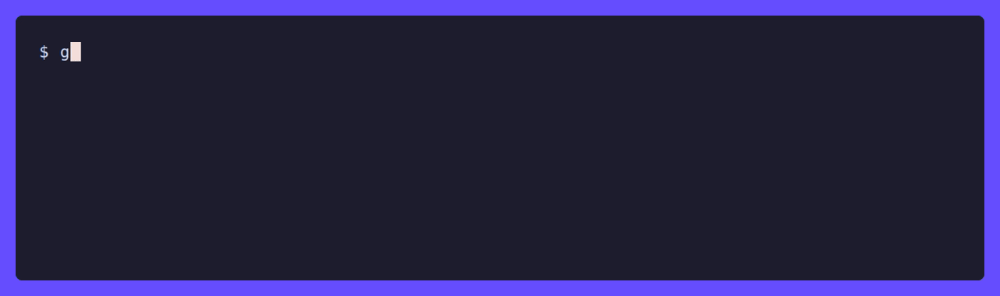
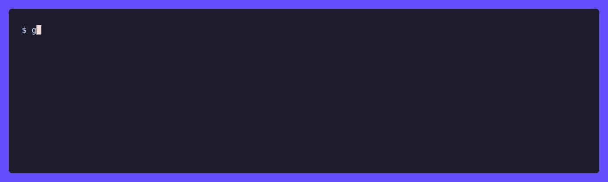

<div align="center">

# better-icons8-mcp

**MCP server for the full Icons8 library: icons, illustrations, animated illustrations, 3D models and photos, in every format Icons8 serves.**

[](https://github.com/torkay/better-icons8-mcp/actions/workflows/ci.yml)
[](https://pkg.go.dev/github.com/torkay/better-icons8-mcp)
[](https://goreportcard.com/report/github.com/torkay/better-icons8-mcp)
[](https://github.com/torkay/better-icons8-mcp/releases)
[](LICENSE)

</div>

Install it as a Claude Code plugin, sign in to Icons8 once in a browser window, and any MCP host can search 172 icon styles and 345 illustration styles and write SVG, Lottie, WebM, MP4, FBX, GLB and photo files to disk. There is no API key and nothing to paste.



## Installation

Inside Claude Code:

```
/plugin marketplace add torkay/better-icons8-mcp
/plugin install icons8@better-icons8-mcp
```

Then ask Claude to connect your account. It calls `icons8_authorize`, a browser window opens on the Icons8 sign-in page, and the session is stored on your machine when you log in. That is the entire setup.

The plugin fetches the server binary for your platform on first run and verifies it against the published checksum, so Go is not required.

<details>
<summary>Other MCP hosts, or no plugin system</summary>

```sh
go install github.com/torkay/better-icons8-mcp/cmd/icons8-mcp@latest
icons8-mcp auth       # opens the sign-in window
icons8-mcp status     # confirms the account and licence
```

Then register the binary. For Claude Code:

```sh
claude mcp add icons8 -s user -- icons8-mcp
```

For Cursor, Windsurf, VS Code agent mode and Claude Desktop:

```json
{
  "mcpServers": {
    "icons8": {
      "command": "icons8-mcp"
    }
  }
}
```

`icons8-mcp` with no arguments is the MCP server speaking stdio, which is what the host runs. The subcommands are for the parts a person does by hand: `auth`, `status`, `tools`, and `import <file>` for machines with no display.

</details>

Downloads land in `~/.icons8-mcp/assets/{icons,illustrations,models3d,photos}/`. Download tools return the path they wrote, never the bytes. A 2 MB base64 PNG in a tool result is unusable context.

## Why not just use icons8-mcp@icons8?

Because it only does icons, and only on a paid plan.

The official server exposes two tools over hosted HTTP: icon search and icon fetch. Illustrations, animated illustrations, 3D models and photos are not behind it at any price. Its free tier returns 100x100 PNG previews that require attribution, and production SVG needs an API key from a paid Icons subscription.

That subscription is the problem for anyone whose access came from the [GitHub Student Developer Pack](https://education.github.com/pack). The pack covers "downloads of all asset types with no limits on quantity, size, or format", and [Icons8 states](https://intercom.help/icons8-7fb7577e8170/en/articles/4729193-do-you-have-discounts-for-students) that it "does not include API access or the MCP server". Those require a separate Icons subscription. The licence already permits every download; only the machine-readable path is withheld.

|  | icons8-mcp | Better icons8 mcp |
|---|---|---|
| Icons | ✅ | ✅ |
| Illustrations | ❌ | ✅ |
| Animated assets | ❌ | ✅ |
| 3D assets | ❌ | ✅ |
| Photos | ❌ | ✅ |
| Auth | Paid API key | Free student subscription |
| Runs | Hosted HTTP | Local binary over stdio |
| SVG | Paid tier | Reflects plan |
| Tools | 2 | 19 |

> [!IMPORTANT]
> This is a client for an account you already have. It does not unlock anything a plan does not cover and does not bypass payment. Every request is authenticated as you and carries the same licence terms as clicking Download in the browser. See [Icons8's licensing](https://icons8.com/license).

## Tools


**Icons**

| Tool | Does |
|---|---|
| `icons8_search_icons` | Search by term, filtered by style, category, author or animation |
| `icons8_icon_styles` | 172 styles and their categories, with the family each belongs to |
| `icons8_icon_pack` | A whole style and category set, already visually matched |
| `icons8_icon_variants` | The same glyph in every other style |
| `icons8_similar_icons` | Visually similar icons, by vector search |
| `icons8_download_icon` | svg, png, pdf, eps, jpg, webp. Also gif, apng and Lottie json when animated. Multi-size, recolourable, simplified SVG |
| `icons8_icon_favicon` | A favicon or app-icon set for favicon/web/ios/android/macos/windows, a multi-resolution `.ico`, and the HTML snippet |
| `icons8_icon_embed` | CDN link, base64 PNG and SVG data URIs, raw markup. Writes no files |
| `icons8_check_unlock` | Which icons this account has already downloaded |

**Illustrations, animation and 3D**

| Tool | Does |
|---|---|
| `icons8_search_illustrations` | Illustrations, animated illustrations, or 3D models with `models`. Filters: style, category, mood, technique, colour |
| `icons8_illustration_styles` | 345 styles with item counts and which ones animate |
| `icons8_illustration` | Detail for one item, including which formats it has |
| `icons8_similar_illustrations` | Items in the same visual family |
| `icons8_download_illustration` | png-hd, png, png-low, svg, gif, gif-low, Lottie json, webm, mov-avc, mov-hevc (mp4), aep, fbx, glb |

**Photos**

| Tool | Does |
|---|---|
| `icons8_search_photos` | Photography and transparent cut-outs |
| `icons8_photo_suggest` | Search terms that return results |
| `icons8_download_photo` | Native resolution, or resized server-side |

**Session**

| Tool | Does |
|---|---|
| `icons8_authorize` | Open the sign-in window and store the session. Run once |
| `icons8_account` | Identity, licence coverage, token expiry, asset directory |

One prompt is registered, `icons8_asset_plan`. It walks an agent through choosing a style and sourcing the assets an artefact needs.

### Which format for which target

| Target | Format |
|---|---|
| Web or app UI icon | `svg` |
| Icon that must be raster | `png` at explicit sizes |
| Favicon or app-icon set | `icons8_icon_favicon` |
| Static artwork | `svg`, or `png-hd` for raster |
| Web motion | `json` (Lottie) |
| Motion with transparency | `webm` |
| Motion on Apple platforms | `mov-hevc`, an mp4 with alpha |
| Video editing | `mov-avc` |
| After Effects | `aep` |
| 3D on the web, three.js | `glb` |
| 3D in Blender or another DCC tool | `fbx` |
| Print | `pdf` or `eps` |

## How it works

`icons8.com` serves its HTML behind a Cloudflare managed challenge. Its API subdomains are not challenged. That is what makes a plain HTTP client viable.

- **Tool calls are plain HTTP.** Requests go to `search-app`, `api-icons`, `api-img`, `api-ouch` and `photos`, rate-limited, carrying the session JWT and a stable browser fingerprint. No browser process, no page loads, no captcha solver.
- **Sign-in is a real browser, once.** `icons8_authorize` opens a visible Chromium at the Icons8 login page and waits for the `i8token` cookie to appear with readable claims. That is the one signal common to email, Google, Apple and GitHub sign-in, which do not share a completion event.
- **The session renews itself.** `GET /user/v2` returns a freshly minted JWT on every call. A background loop keeps a 10-day token alive, so signing in is a one-off.
- **A headless browser handles recovery.** If a request is rejected as unauthorized and the cheap refresh does not fix it, [go-rod](https://github.com/go-rod/rod) with [`go-rod/stealth`](https://github.com/go-rod/stealth) drives a real Chromium through the Cloudflare challenge and harvests the resulting session. Measured at about 14 seconds by `go run ./cmd/reauthcheck`.

> [!NOTE]
> On a machine with no display, the sign-in window cannot open. Export cookies for `icons8.com` and run `icons8-mcp import <file>` instead. [`demo/cookies.example.json`](demo/cookies.example.json) shows the expected shape.

`docs/api.md` holds the endpoint map. Read it before changing a query. Several Icons8 parameters fail silently: a wrong parameter name returns HTTP 200 with unfiltered results instead of an error. Illustration filters are split across two mechanisms. `style_pretty_id` and `animated` are query parameters. `mood`, `technique` and `colors` belong inside a `meta` JSON blob. Sending one in the other's place is ignored.

## The skill

The plugin also installs [`design-assets`](plugins/icons8/skills/design-assets/SKILL.md), which is the part that changes agent behaviour. Connecting a server does not stop a model improvising artwork. An instruction to treat assets as part of the plan does.

Its main rule is to pick one icon style and one illustration style before searching. There are 172 and 345 of them. Mixing styles is the most common reason a generated interface looks assembled rather than designed. The rest of the file is a format table, a note that the "locked" badge is bookkeeping rather than a restriction, and a list of substitutions to avoid.

## Configuration

Every setting is an environment variable with a working default.

| Variable | Default | Meaning |
|---|---|---|
| `ICONS8_MCP_HOME` | `~/.icons8-mcp` | State directory |
| `ICONS8_ASSET_DIR` | `$ICONS8_MCP_HOME/assets` | Where downloads land |
| `ICONS8_COOKIE_FILE` | `$ICONS8_MCP_HOME/cookies.json` | Session bootstrap for `import` |
| `ICONS8_RPS` | `6` | Requests per second ceiling |
| `ICONS8_CONCURRENCY` | `4` | Parallel requests |
| `ICONS8_REFRESH_INTERVAL` | `6h` | Rolling JWT refresh |
| `ICONS8_AUTH_TIMEOUT` | `5m` | How long the sign-in window waits |
| `ICONS8_BROWSER_FALLBACK` | `1` | `0` disables Chrome, including sign-in |
| `ICONS8_HEADFUL` | unset | `1` shows the recovery browser |
| `ICONS8_LOCALE` | `en-US` | Search language |
| `ICONS8_MCP_BIN` | unset | Path to a binary the plugin launcher should use instead of downloading one |

## Development

```sh
go test ./...                              # offline unit tests
go run ./cmd/smoke -bin ./dist/icons8-mcp  # 29 checks against the live API
go run ./cmd/reauthcheck                   # exercise headless-browser recovery
claude --plugin-dir ./plugins/icons8       # load the plugin without installing it
```

The smoke suite drives the built binary over stdio the way an MCP host does. Later checks reuse ids and styles taken from earlier results rather than hard-coded fixtures, so it fails when the API changes shape.



`cmd/recon` and `cmd/reconflow` are the discovery tools that produced `docs/api.md`. `reconflow` shims `fetch`, `XMLHttpRequest`, `URL.createObjectURL` and `HTMLAnchorElement.click` inside the page, because CDP's Network domain misses requests that finish as browser-level downloads. That is how the SVG download endpoint was found.

Demo GIFs are recorded with [VHS](https://github.com/charmbracelet/vhs): `make demo`.

## Acknowledgements

Built on the [MCP Go SDK](https://github.com/modelcontextprotocol/go-sdk), [go-rod](https://github.com/go-rod/rod) and [VHS](https://github.com/charmbracelet/vhs). Not affiliated with or endorsed by Icons8.
